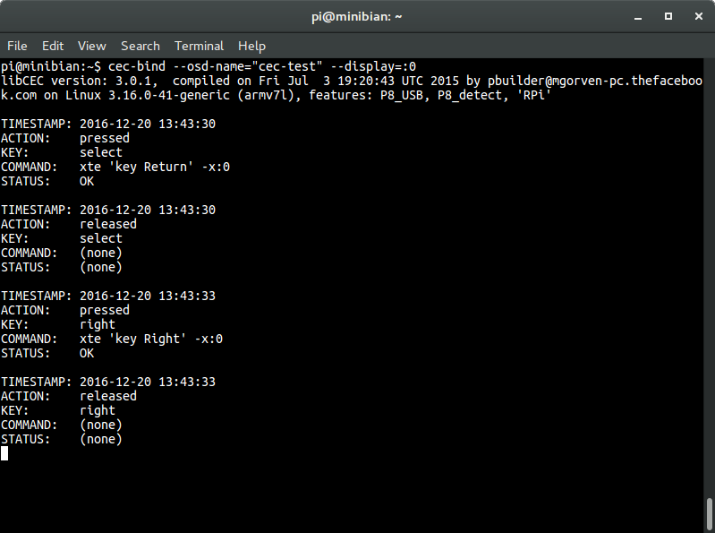

cec-bind
========

Simple `cec-client` wrapper.

This script starts CEC client in the background.
Every remote control key event (pressed, released, auto-released)
can be 'converted' into keyboard event (as set in [config](src/config.map) file).

### Dependencies

- [cec-client](https://github.com/Pulse-Eight/libcec)
- [xautomation](https://linux.die.net/man/7/xautomation)
- [perl](http://perldoc.perl.org/perl.html)

### Usage

	cec-bind [OPTIONS]

### Options

	-h|--help             show this help
	--config=[VALUE]      path of keymap config file
	--osd-name=[VALUE]    set CEC client OSD name
	--display=[VALUE]     remote X server

### Install

	cd /tmp
	git clone https://github.com/fffilo/cec-bind.git
	chmod +x cec-bind/src/cec-bind.sh
	sudo mv cec-bind/src/cec-bind.sh /usr/local/bin/cec-bind
	mv cec-bind/src/config.map ~/.cec-bind

### Screenshot

